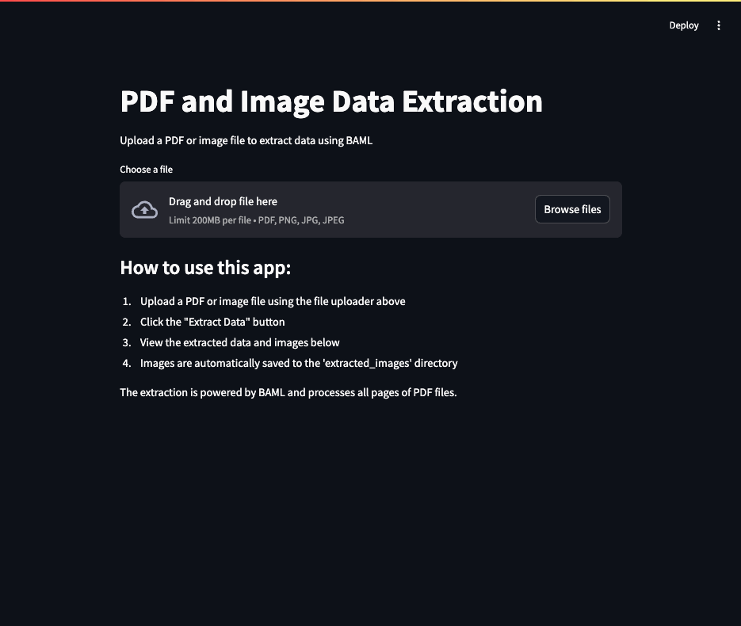

# PDF and Image Extraction API

This project provides a FastAPI backend for transforming PDFs into images for the purposes of structured
data extraction via BAML. It includes a Streamlit frontend for easy interaction and usage.

## Key Components

- **FastAPI Backend** - REST API for processing PDFs into images
- **Streamlit Frontend** - User-friendly web interface for file uploads and results
- **PDF Processing** - Converts PDFs to images for analysis
- **BAML Integration** - Generate a concise summary of the PDF document that was transformed into images

## Setup and Installation

### Install `uv` environment

1. Install `uv` if you don't have it already:
   ```bash
   curl -LsSf https://astral.sh/uv/install.sh | sh
   ```

2. Create and activate a virtual environment:
   ```bash
   uv venv
   source .venv/bin/activate  # On Windows: .venv\Scripts\activate
   ```

3. Install dependencies:
   ```bash
   uv pip install -r requirements.txt
   ```

## Run FastAPI server

### Development Mode

Run the server in development mode with auto-reload:
```bash
uv run fastapi dev app/main.py
```

If you're using environment variables:
```bash
uv run dotenv run fastapi dev app/main.py
```

### Production Mode

Run the server in production mode:
```bash
uv run fastapi run app/main.py
```

### [Optional] Use Docker for production

If you want to run the FastAPI server in production, you can use Docker.

1. Build the Docker image:
   ```bash
   docker build -t fastapi-app .
   ```

2. Run the container:
   ```bash
   docker run -p 8000:8000 fastapi-app
   ```

3. For production with environment variables:
   ```bash
   docker run -p 8000:8000 --env-file .env fastapi-app
   ```

## Running the Streamlit App

1. Make sure the FastAPI server is running first.

2. Run the Streamlit app:
   ```bash
   streamlit run streamlit_app.py
   ```

3. Open your browser to the URL provided by Streamlit (usually http://localhost:8501).

4. Upload a PDF or image file, click "Extract Data", and view the results.

5. Extracted images will be saved to the `extracted_images` directory.

## Testing the API Directly

You can test the API endpoint using curl:

```bash
curl -X POST -H "Content-Type: multipart/form-data" -F "file=@files/images/invoice.png" http://localhost:8000/extract
```

Make sure the file path (`files/images/invoice.png`) points to an existing file on your system.

## API Endpoints

The following endpoints are available:

- `GET /`: Information about the API
- `POST /extract`: Upload a PDF or image file to extract data using BAML

Add more endpoints that use BAML to extract structured data from the images as necessary.

## Demo of the API and Streamlit app

- Run the FastAPI server in development mode
  - `uv run fastapi dev app/main.py`
- Run the Streamlit app
  - `streamlit run streamlit_app.py`
- Open your browser to the URL provided by Streamlit (usually http://localhost:8501)
- Upload a PDF or image file, click "Extract Data", and view the summary of the document
and a preview of the extracted images (the images are saved to the `extracted_images` directory)

